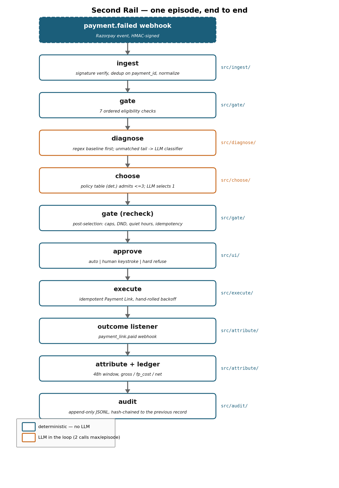

# Second Rail

Diagnoses Razorpay payments that failed after the customer left, takes one bounded reversible action, and measures what came back against a 200-episode test-mode batch. Deterministic guardrails, constrained LLM decisions, hash-chained audit trail.

## Quickstart

```bash
git clone https://github.com/nirmalraj142007-byte/second-rail.git && cd second-rail
make setup          # pinned venv, no API key needed
make eval           # sealed-split evaluation -> evidence/report.md, ~20s, no key, no network
make verify-audit   # walks the hash chain, prints "chain intact - N records"
```

## What it does

One episode, end to end — eight stages, plus the audit chain every one of them writes into as it goes:

1. **ingest** — signature verify, dedup on `payment_id`, normalize (`src/ingest/`, no LLM)
2. **gate** — 7 ordered eligibility checks (`src/gate/`, no LLM)
3. **diagnose** — regex baseline first; only the unmatched tail reaches the LLM classifier (`src/diagnose/`)
4. **choose** — a policy table (deterministic) admits an already-narrowed set of at most 3 actions; the LLM picks 1 (`src/choose/`)
5. **gate, again** — post-selection re-check: caps, DND, quiet hours, idempotency (`src/gate/`, no LLM)
6. **approve** — auto below the ceiling, a human keystroke above it, hard refuse in a third band (`src/ui/`, no LLM)
7. **execute** — idempotent Payment Link, hand-rolled backoff (`src/execute/`, no LLM)
8. **attribute** — outcome listener, 48h window, ledger: gross / false-positive cost / net (`src/attribute/`, no LLM)

A model choosing between payment-recovery options with no fence around it can sound convincing and still be wrong. So it never invents an action or touches a rupee amount — it only picks from a short list a human already approved for that exact situation, and money never moves without either an automatic pass or a person's keystroke. Every decision gets written into a log that can't be quietly edited afterward, because "trust me, it worked" isn't something anyone should have to take on faith.

That is the pipeline's *shape*, not a claim that a live `payment.failed` webhook runs straight through it today. The webhook endpoint's own job stops at ingest — signature verification, dedup, normalization, nothing else, deliberately, so an LLM call or a Razorpay outage can never make that endpoint itself slow or unavailable (`src/ingest/app.py`'s module docstring). Gate through attribute run in batch mode, against already-ingested episodes (`make eval`, `make demo`), not inline per-webhook. See [docs/out-of-scope.md](docs/out-of-scope.md)'s "Real-time webhook-to-pipeline processing" entry, below, for why, and what would have to change first.

**On positioning.** Razorpay already ships payment links, Optimizer, Intelligent Payment Retry and abandoned-checkout recovery, and merchants run their own retry emails — this is not an empty category. The seam this project owns is narrower: **automated per-episode diagnosis driving a bounded, gated, audited action** for failures that land after the session is gone. Razorpay's own Optimizer launch material states that nearly 33% of failed transactions are never re-attempted — that is their figure and their claim, cited as such, not a number measured here.

## Results

Full detail, including the confusion matrix and the exception list, is in **[evidence/report.md](evidence/report.md)**, which is committed — every result is readable without running anything.

Sealed split: sha256-verified, 200 episodes (`holdout/SEAL.sha256`). Shift: `BANK_E` is reserved for the sealed split only — it never appears in `data/train.jsonl`. Attribution rule AR-01, window 48h (pre-registered in [outcome_model.md](outcome_model.md) §3).

The ordering below is deliberate. The numbers that did not pass through a model written for this project come first.

### 1. Non-circular — measured against real API responses and real counts

Guardrail proof, real Razorpay test-mode API, N capped at 108 (the full gate-eligible set in `data/train.jsonl`); the run's own consecutive-executor-error tolerance was raised to 5 to absorb sporadic real rate-limiting, and it still stopped at 10/108 requested episodes — a small N, stated as one, not rounded up.

| metric | value |
|---|---|
| duplicate links created, real Razorpay test-mode API | **0** |
| cap breaches | **0** |
| quiet-hour contacts | **0** |
| idempotency collisions correctly detected | **10/10** |
| action admissibility rate | **100.0%** (n=108) |

Separately, the full 200-episode sealed-batch run through `make eval` (fixture executor, no live calls): throughput **1,310 episodes/min** over 131/200 processed before the `cap_breach` stopping rule fired — the other 69 are not silently dropped, they are `pending` in the run's own accounting invariant (`src/runner.py`). LLM cost, cache ignored (what an empty cache would have cost, recomputed from real token counts): **Rs 0.55 per 100 episodes**. Cache hit rate this run: 100% (109/109 calls that needed the model; 107 diagnoses were resolved by regex for free).

### 2. Externally anchored — labels not authored for this evaluation

Real `error_code` / `error_reason` strings forced out of Razorpay's own test-mode failure simulation, plus Razorpay's published error-code documentation as an independent label source.

| source | n | regex | LLM |
|---|---|---|---|
| harvested strings (raw, real fields) | 20 | 5.0% | 20.0% |
| Razorpay doc snapshot | 17 | 82.3% | 88.2% |

### 3. Where the model loses

On the harvested strings — the hardest and most externally-anchored data in this evaluation — **classifier accuracy collapses to 20.0%**. The LLM beats the regex baseline there (5.0%), but that is not the finding worth taking seriously: both are weak, and the humbling number is the 20.0%, not which method produced it. Separately, on the top five error families by volume, **free regex ties the paid model at 100% on both**. The model earns its cost only on the unmatched tail.

### 4. Recovery — a design target, not a measurement

**NET Rs 51,482 – Rs 95,580** across the 200-episode sealed split (99/108 gate-eligible episodes contacted before `cap_breach` fired), against a `FIXED_RETRY_AT_T30` baseline of **NET Rs 51,412 – Rs 95,449** (102/102 gate-eligible episodes contacted), net of false-positive cost, as a range under a ±30% sweep of three pre-registered parameters: response probability, attribution window (a structural no-op in this expected-value method — see `src/report/sensitivity.py`), and the goodwill proxy.

Read that number sceptically. It passes through a customer-response model written specifically for this project, pre-registered in [outcome_model.md](outcome_model.md) before any eval ran (`git log` confirms the timestamps). The sweep perturbs self-authored parameters and widens a band around a quantity that was invented, not measured. It is disclosure, not evidence. Sections 1–3 are the evidence.

## No code path in Second Rail moves money

This is the design's spine, so it is a heading and not a sentence buried in a paragraph.

The only external effect this system can produce is a **cancellable Razorpay Payment Link** with `expire_by` set, which the customer authenticates themselves. There is no debit, no refund, no payout, no transfer, no auto-capture — not gated behind a flag, not implemented and disabled. Those API calls do not exist in `src/`; `grep -rn 'payouts\|transfers\|\.capture(' src/` returns nothing beyond the Razorpay Payments API's own `payment_id` capture-status field. `make rollback RUN_ID=x` cancels every link a run created and prints a per-link result table. Default mode is `--dry-run`; real Razorpay calls require an explicit `--execute`. This endpoint whitelist is enforced by [tests/test_claims.py](tests/test_claims.py).

## Where the LLM is and is not

The model does exactly two things per episode, both content-hash cached: classify a cause when the regex baseline does not match, and pick one action from an already-narrowed set of at most three. Everywhere else it is refused outright — not discouraged, refused, with a test that greps the package for the client symbol and fails the build if it's there.

It never computes an amount, evaluates a cap, decides eligibility or quiet hours, determines attribution, produces any reported metric, or chooses an action outside the policy table's admissible set. `src/gate/`, `src/execute/`, `src/attribute/`, `src/audit/`, `src/ingest/` and `src/db/` are enforced LLM-free by [tests/test_llm_boundary.py](tests/test_llm_boundary.py).

The full list, with the enforcing test named against each refusal, is in **[docs/where-the-llm-is-not.md](docs/where-the-llm-is-not.md)**.

## Guardrails

Every money-adjacent threshold lives in [config/guardrails.yaml](config/guardrails.yaml) — rendered in full below, 17 lines, every number with its own justification comment. `grep -rn '5000\|₹' src/` returns nothing.

```yaml
# Second Rail — guardrail thresholds. Every money-adjacent number the
# system enforces lives here, not in src/. See CLAUDE.md non-negotiables.
max_actions_per_payment: 1          # not experimentally derived: one attempt per payment_id is the proposal's own scope contract (CLAUDE.md), not a tunable
max_contacts_per_customer_7d: 2     # not experimentally derived: fixed compliance-style cadence cap, a policy choice like quiet_hours below, not swept
quiet_hours: {start: "21:00", end: "09:00", tz: "Asia/Kolkata"}   # not experimentally derived: standard no-contact-overnight convention, a policy choice, not an optimisation target
max_episode_age_hours: 72           # not experimentally derived: fixed so it stays longer than attribution_window_hours (48h) per outcome_model.md §3's reasoning, not swept independently
auto_approve_ceiling_paise: 500000  # Rs 5,000 — queue 8.5% of 400 train episodes, exposure Rs 106,526/run; Rs 2,000 already pushes the queue to 24.8%; see experiments/thresholds/auto_approve.md
batch_contact_ceiling: 50           # not experimentally derived: blast-radius cap on a bad config, not swept this phase — see experiments/thresholds/auto_approve.md's method section for why it had to be held fixed while sweeping auto_approve_ceiling_paise
per_run_exposure_ceiling_paise: 20000000    # not experimentally derived: notional per-run cap, not swept this phase
outage_cluster_threshold: 15        # catches the full 40-episode planted outage with 0% false escalations on the train split; threshold=40 (matching cluster size) misses it entirely — see experiments/thresholds/outage_cluster.md
executor_retry_cap: 3               # recovers 5/15 vs 10/15 at cap=10, for 20 fewer wasted API calls and ~28s less modeled wall-clock per still-abandoned episode; see experiments/thresholds/retry_cap.md
executor_backoff_seconds: [1, 2, 4]  # not experimentally derived: sized to match executor_retry_cap's length; exercised (not independently swept) by experiments/thresholds/retry_cap.md
consecutive_executor_errors_stop: 3  # not experimentally derived: 3 back-to-back failures as a systemic-failure signal, a policy choice, not swept this phase
kill_switch_path: "KILL"            # presence of this file on disk halts the run before the next episode starts
default_mode: dry_run               # execution requires --execute
attribution_window_hours: 48        # not experimentally derived: fixed in outcome_model.md §3 and cross-checked against it by scripts/config_check.py check 8, not swept this phase
```

Escalation is tiered, not binary: `auto` below the ceiling, `human_keystroke` above it, `hard_refuse` in a third band (issuer-outage cluster, opted-out, already paid, older than 72h). Each tier is written to the audit log with a named reason, not just a tier label.

Three of these thresholds have an experiment behind them rather than a guess — auto-approve ceiling, outage-cluster threshold and retry cap — in [experiments/thresholds/](experiments/thresholds/). The rest carry an explicit "not experimentally derived" marker saying so, and `make config-check` fails if any number has neither.

```bash
make config-check   # 9 checks over the config surface
make judge-check    # 18 checks over the whole submission
```

## Limitations

The honest ones, in full, are in [LIMITATIONS.md](LIMITATIONS.md) and [docs/scaling-failures.md](docs/scaling-failures.md). The three that matter most:

- **The recovery figure is simulated.** No real customer decided whether to pay. The assumption file is committed and pre-registered; the three metric groups above it are not affected.
- **The data is synthetic.** DPDP Act 2023 — no real PII, ever. The seeded generator is committed at [data/generator.py](data/generator.py).
- **This design breaks at 10k episodes/day in three named places**, in the order they would be fixed: the in-process webhook queue, the executor's missing per-issuer circuit breaker, and audit-chain partitioning by run. [docs/scaling-failures.md](docs/scaling-failures.md) has the symptom and the fix for each.

## Out of scope, and why

Every exclusion below has its reason attached. A bare list of things not built reads as a list of things there wasn't time for — several of these would not get built with unlimited time either, because building them honestly requires a registration, a licence, or a rulebook this project does not have, and building them dishonestly is worse than not building them. Full text, rendered inline from [docs/out-of-scope.md](docs/out-of-scope.md):

> Three groups: things this project is **not permitted** to do, things it **chose not to** do, and things it **cut** under a 33-hour budget. The distinction matters — conflating them is how a submission ends up claiming a capability it does not have.

**Not permitted — regulatory, not preferential**

| exclusion | reason |
|---|---|
| Mandates, subscriptions, e-NACH, UPI Autopay | NPCI mandate retry rules govern permitted retry counts and timing; inventing a cadence would be the part a payments engineer checks first. Second Rail never touches an episode originating from a mandate. |
| Real SMS or WhatsApp sending | TRAI's TCCCP regulations require DLT registration (headers, pre-approved templates) for commercial messaging in India. Second Rail sets Razorpay Payment Link's own `notify.sms`/`notify.email` flags in test mode and claims nothing beyond that; any SMS cost quoted in the report is a *stated assumption* from `outcome_model.md`, not a bill paid. |
| Storing, displaying, or logging a card PAN | RBI card-tokenisation norms. Second Rail never sees a PAN — the Razorpay `payment` object doesn't include one, and nothing in `src/` reads, writes, renders, or logs a card number; the synthetic generator doesn't produce one either. |
| Any real PII | The Digital Personal Data Protection Act, 2023. Every customer, payment, contact detail and episode is synthetic, generated by the committed seeded generator at `data/generator.py`. |

**Chose not to — it belongs to someone else, or it would corrupt the evidence**

| exclusion | reason |
|---|---|
| Multi-gateway routing | That is Optimizer, and it is Razorpay's product. Second Rail sits downstream of the point where Optimizer and Intelligent Payment Retry both stop — when the session ends. |
| Fraud and risk scoring | A different problem with an inverted cost asymmetry, evaluated against self-generated labels would prove nothing. Risk-block episodes are classified and routed to `no_action` — diagnosed, never acted on. |
| Training any model | The 20 harvested error strings are a validation set, not a training set; a model trained on this project's own generator would be a closed loop. |
| Real-time streaming infrastructure | Batch replay is the honest shape of the evidence — the claim is about a 200-episode sealed batch with a stated attribution window. What streaming would require is in [docs/scaling-failures.md](docs/scaling-failures.md) §1. |
| Real-time webhook-to-pipeline processing | `src/ingest/app.py`'s own module docstring: the endpoint does the minimum before returning 200, specifically to stay under a 50ms target and to keep an LLM call or a Razorpay outage from ever making the webhook endpoint itself slow or unavailable. Diagnosis, policy resolution and execution run in batch mode against already-ingested episodes, never inline per-webhook. |
| An A/B testing framework | No live traffic to split — both arms would be draws from the same simulator. The `FIXED_RETRY_AT_T30` baseline is stated for what it is: a deterministic counterfactual over the same sealed episodes, not an experiment. |

**Cut under the budget — the skin, not the organ**

| exclusion | reason |
|---|---|
| The web approval UI | The approval *gate* is what matters — a human keystroke above the ceiling, written to the audit log. Fell back to a JSON queue + `make approve`; a read-only companion dashboard exists at `src/webui/` but nothing in the pipeline depends on it running. |
| Hinglish copy generation | Zero rubric weight and a real risk of sounding worse than English. English-only templates with LLM-filled slots do the same job. |
| Breadth of the sensitivity sweep | Cut from "every parameter" to exactly three — response probability, attribution window, goodwill proxy — the ones that actually move the recovery figure. |
| The second baseline | Kept one (`FIXED_RETRY_AT_T30`) alongside the do-nothing case the uncontacted episodes already provide; a second baseline would have been a third arm of the same simulator. |

**Infrastructure deliberately absent:** no queue, no auth provider, no messaging provider, no cloud deploy, no Docker, no CI/CD, no multi-tenancy, no RBAC, no mobile UI — because the acceptance test that matters most for this submission is `git clone && make setup && make eval` in under five minutes with no API key, and every one of those is a thing that can break on someone else's machine. Full reasoning and the historical/regulatory citations: [docs/out-of-scope.md](docs/out-of-scope.md).

## Architecture



Generated by [scripts/gen_architecture.py](scripts/gen_architecture.py) (the editable source — edit the `STAGES` list and rerun it; there is no separate binary diagram file, see that script's own docstring for why). [scripts/check_architecture.py](scripts/check_architecture.py) asserts every module the diagram names still exists under `src/`, so it cannot silently drift from the code.

| module | responsibility | LLM? |
|---|---|---|
| `src/ingest/` | webhook receipt, signature verify, dedup, normalization | no |
| `src/gate/` | eligibility checks, caps, quiet hours, frequency, escalation tier | no |
| `src/diagnose/` | regex baseline + LLM classifier + confidence + rationale | 1 call max |
| `src/choose/` | policy engine → admissible set; LLM selects 1 of ≤3 | 1 call, constrained |
| `src/execute/` | idempotency, retry/backoff, Payment Links, rollback | no |
| `src/attribute/` | outcome listener, attribution window, ledger | no |
| `src/audit/` | hash chain, append, verify | no |
| `src/ui/` | approval queue (`make approve`), read-only demo webui | no |

Stack: Python 3.11, FastAPI, Pydantic 2.9, SQLite (WAL), Typer, Rich, matplotlib, raw `httpx` for Payment Links so the request and response land in the audit record verbatim. No queue, no auth provider, no cloud deploy, no Docker, no CI — each a deliberate cut, listed with its reason in [docs/out-of-scope.md](docs/out-of-scope.md) above.

## Build notes

[BUILD_LOG.md](BUILD_LOG.md) has one entry per working session from day one, including a `## Wrong turns` index at the top pointing at every place the first hypothesis was wrong.

[KNOWN_ISSUES.md](KNOWN_ISSUES.md) carries the defects found and not yet closed, rather than the ones fixed quietly.

## How to check this in 90 seconds

`make judge-quickstart` prints this same sequence with the expected outcome of each step — [scripts/judge_quickstart.py](scripts/judge_quickstart.py) is the single source for both.

| step | expected outcome |
|---|---|
| `git clone https://github.com/nirmalraj142007-byte/second-rail.git && cd second-rail` | repo present locally |
| `head -40 README.md` | seam, quickstart, and the no-code-moves-money heading all visible on one screen |
| `make setup` | pinned venv installs clean, no errors |
| `make eval` | `evidence/report.md` regenerated, under 5 minutes, no API key, no network |
| `cat evidence/report.md` | sections 1–4 in order: guardrail correctness, admissibility, cost/throughput, externally-anchored classification, then a recovery RANGE (never a point estimate) |
| `make verify-audit` | prints `chain intact - N records` in under 2 seconds |
| `cat config/guardrails.yaml` | every money-adjacent number, each with its own justification comment, under 60 lines |
| `cat docs/where-the-llm-is-not.md` | the closed list of decisions the LLM is refused, each with the test that enforces it |
| `cat BUILD_LOG.md` | one entry per working session from D1, including a "Wrong turns" index |
| `git log --format='%ad %s' --date=short \| tail -30` | dated commit history; `outcome_model.md`'s commit predates `src/attribute/`'s |

Everything else a judge might run:

```bash
make judge-check                                # 18 checks, exits 1 on any failure
make artifact-scan                               # fails on drafting artifacts / unwritten markers
make demo                                        # dry-run by default; EXECUTE=1 for real calls
make rollback RUN_ID=x                           # cancel every link a run created
make verify-audit-tamper                         # proves the chain detects tampering
make thresholds                                  # re-runs the three threshold experiments
make guardrail-proof N=200                       # real Payment Link creations under fault injection
```

---

*Not legal advice. The compliance items named above and in [LIMITATIONS.md](LIMITATIONS.md) and [docs/out-of-scope.md](docs/out-of-scope.md) — DPDP Act 2023, TRAI DLT, RBI tokenisation, NPCI mandate retry rules — are flagged because they are load-bearing for what this project claims, not because this constitutes a compliance review. Anything shipped for real needs counsel.*
