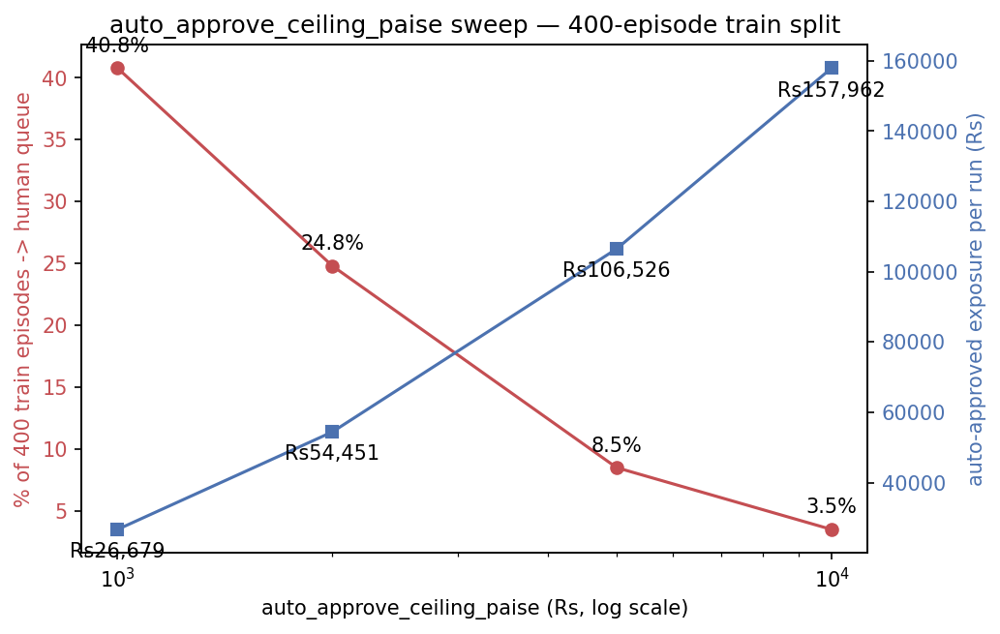

# Experiment 1 — `auto_approve_ceiling_paise`

## Question

`config/guardrails.yaml` set `auto_approve_ceiling_paise: 500000` (Rs 5,000) with a `# TODO justify` comment. What does moving that ceiling actually cost or buy, on this project's own 400-episode train split?

## Method

Swept `auto_approve_ceiling_paise` over Rs 1,000 / 2,000 / 5,000 / 10,000 (100000/200000/500000/1000000 paise). At each setting, ran the real `src.gate.engine.GateEngine` — the identical class `src/runner.py` calls internally, not a re-implementation — over all 400 `data/train.jsonl` episodes in file order, carrying a real `RunState` forward (exposure and frequency accounting accumulate exactly as a live run's would). No LLM calls, no executor calls: this threshold is resolved entirely inside the gate (`_compute_tier()`), before diagnose/choose/execute are ever reached.

Three scoping decisions, all because this is a per-threshold config experiment rather than a live-run demo. First, `batch_contact_ceiling` (a separate guardrail: any episode past the 51st eligible contact this run also routes to the human queue, regardless of amount) is pinned to an effectively-infinite value for this sweep only — left at its real value of 50, it swamps the amount ceiling's own effect: on an early run of this sweep with `batch_contact_ceiling` untouched, the queue percentage barely moved between Rs 1,000 and Rs 10,000 (80.8% to 74.0%) because most of the queue was batch-cap-driven, not amount-driven. `config/guardrails.yaml`'s real `batch_contact_ceiling` value is untouched by this change; it is not this experiment's subject. Second, the four run-level stopping rules (`src/gate/stopping.py`) are not applied, so all four settings see the full 400 episodes rather than being truncated by an unrelated cap breach at the same episode index. Third, "% routed to the human queue" is computed over all 400 episodes (tier is assigned before the other six checks run), while "auto-approved exposure" and "high-value episodes unreviewed" are restricted to gate-eligible episodes, since only those would ever produce a real Payment Link.

## Results

| ceiling | % -> human queue (of 400) | gate-eligible | auto-approved exposure/run | high-value segment auto-approved |
|---|---|---|---|---|
| Rs 1,000 | 40.8% (163/400) | 108 | Rs 26,679 | 17 |
| Rs 2,000 | 24.8% (99/400) | 108 | Rs 54,451 | 20 |
| Rs 5,000 | 8.5% (34/400) | 108 | Rs 106,526 | 25 |
| Rs 10,000 | 3.5% (14/400) | 108 | Rs 157,962 | 26 |

## Conclusion

At Rs 2,000 the gate fires on 24.8% of episodes — roughly 1 in 4 — which is already past "review the unusual case" and into "review a routine fraction of every batch"; at Rs 10,000 the auto-approved exposure reaches Rs 157,962 per run, with 26 high-value-segment episode(s) auto-approved unreviewed, versus 25 at Rs 5,000. Rs 5,000 keeps the queue at 8.5% and exposure at Rs 106,526 — the first setting in this sweep where the queue is small enough to plausibly mean "the unusual case" rather than "most of the batch".

## What I would measure with more time

This sweep uses `data/train.jsonl`'s one fixed amount distribution. A merchant with a higher median ticket size would need a proportionally higher ceiling to keep the same queue percentage — the right next experiment is re-running this sweep against a synthetic distribution with a 3-5x higher median, to see whether Rs 5,000 is a property of this specific dataset or holds up as a ratio-to-median instead.
