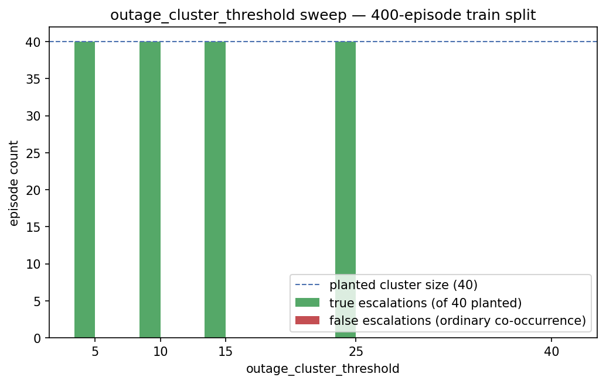

# Experiment 2 — `outage_cluster_threshold`

## Question

`config/guardrails.yaml` set `outage_cluster_threshold: 15` with a `# TODO justify` comment. `data/generator.py` plants exactly one real 40-episode issuer-outage cluster the gate must catch and hard-refuse as a group. Where does the trade-off between catching that outage and wrongly escalating ordinary cause co-occurrence actually sit?

## Method

Swept `outage_cluster_threshold` over {5, 10, 15, 25, 40}. At each setting, called the real `src.gate.engine.compute_cluster_membership` — the exact function `src/runner.py` calls before gating a single episode, not a re-implementation — over all 400 `data/train.jsonl` episodes. That function groups episodes by `error_reason` and flags every episode in any run of more than `threshold` episodes sharing a reason inside a sliding 30-minute window. **True escalation:** a flagged episode that is one of the 40 planted `edge_case="issuer_outage_cluster"` episodes. **False escalation:** a flagged episode that is not — an ordinary cause co-occurrence the sliding window caught by chance. The false-escalation rate is false escalations over the 360 non-planted episodes (the population actually at risk of a false escalation).

## Results

| threshold | true escalations (of 40) | planted cluster fully caught | false escalations | false-escalation rate |
|---|---|---|---|---|
| 5 | 40/40 | yes | 0 | 0.0% |
| 10 | 40/40 | yes | 0 | 0.0% |
| 15 | 40/40 | yes | 0 | 0.0% |
| 25 | 40/40 | yes | 0 | 0.0% |
| 40 | 0/40 | NO | 0 | 0.0% |

### False-escalation groups at the current default (threshold=15)

| error_reason | episodes wrongly swept in |
|---|---|
| (none) | 0 |

## Conclusion

Threshold 15 catches the full planted 40-episode outage (40/40) with a 0.0% false-escalation rate; threshold 40 — matching the cluster size exactly — misses the outage entirely (0/40 caught), because the check requires a group to *exceed* the threshold, not merely meet it, so 40 must never be the configured value despite matching the planted cluster size. The finding that shrinks this experiment's own claim: every threshold from 5 to 25 ties at 0% false escalations on this dataset, because the generator spreads ordinary episodes uniformly across a 30-day window, making coincidental 30-minute co-occurrence statistically negligible — this batch cannot empirically distinguish 5 from 15 on false-escalation cost alone. 15 is kept as a safety margin below 25 and well clear of the 40 off-by-one, not a value this specific dataset forced.

## What I would measure with more time

The false-escalation rate is 0% at every threshold this sweep tested below 40, which means this dataset cannot actually validate the safety margin between 5 and 15 — `data/generator.py` scatters ordinary episodes uniformly across 30 days, so it never produces the kind of real-world traffic burst (a flash sale, a genuinely busy evening) that would make coincidental 30-minute co-occurrence common. The right next experiment is injecting a second, *non-outage* synthetic burst — e.g. 8-12 ordinary `insufficient_fund` episodes clustered in one real 30-minute window, modelling a busy checkout period rather than a shared failure cause — and re-sweeping against both clusters at once, so the false-escalation side of this trade-off is actually measured rather than defaulting to zero. Re-running with planted outages at several sizes (e.g. 10, 20, 40, 80) instead of only 40 would also test whether 15 catches smaller real outages, not just this one seeded size.
