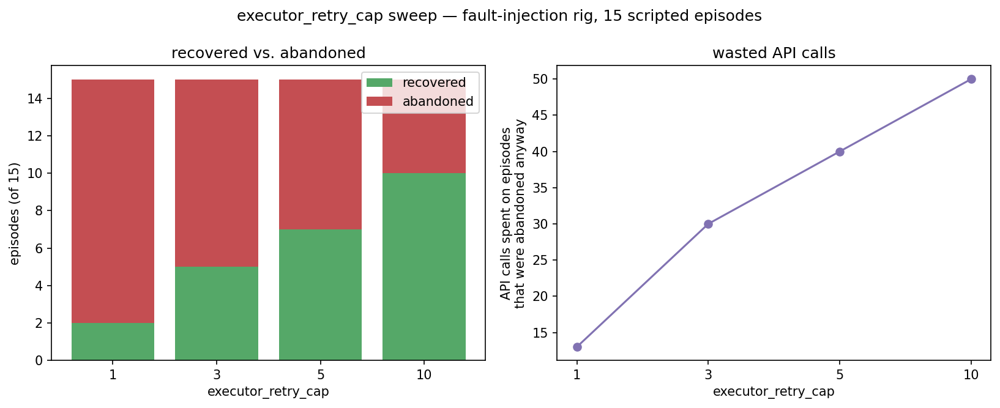

# Experiment 3 — `executor_retry_cap`

## Question

`config/guardrails.yaml` set `executor_retry_cap: 3` with a `# TODO justify` comment. Raising it should recover more transient 429s; it should also cost more real API calls and more wall-clock time on episodes that were never going to succeed. Where does that trade-off actually land?

## Method

Swept `executor_retry_cap` over {1, 3, 5, 10}. At each setting, ran 15 synthetic episodes through the real `src.execute.executor.RazorpayExecutor` — the same class `src/runner.py` calls in `execute` mode, not a re-implementation — each wrapped around a scripted client that returns HTTP 429 for the first `k` calls, then a normal 200. `k` is drawn from a fixed, disclosed distribution (`K_DISTRIBUTION = [0, 0, 1, 1, 2, 3, 4, 5, 6, 8, 10, 12, 15, 20, 25]`): mostly small values (a rate limit that clears fast) with a long tail (an outage that outlasts every cap in this sweep). This exercises the real `with_backoff()` retry loop and the real `RazorpayExecutor.create_recovery_link()` control flow — cap exhaustion raises the same `ExecutorError` production code raises — against a scripted, deterministic fault instead of the live network.

`time.sleep` is monkeypatched to a no-op accumulator for the duration of this script only: the reported "modeled wall-clock time" sums the exact backoff delay VALUES the real `on_attempt` callback computes and would sleep for in production (`executor_backoff_seconds` = [1, 2, 4], repeating 4 for attempts beyond that list) — nothing about the retry arithmetic is simulated, only the literal blocking sleep is skipped so this sweep runs in seconds instead of the several real minutes a k=25 tail at cap=10 would otherwise cost.

## Results

| retry_cap | recovered | abandoned | total API calls | wasted calls (on abandoned episodes) | modeled wall-clock (total, s) | mean modeled seconds to abandon |
|---|---|---|---|---|---|---|
| 1 | 2/15 | 13/15 | 15 | 13 | 0.0 | 0.0 |
| 3 | 5/15 | 10/15 | 39 | 30 | 35.0 | 3.0 |
| 5 | 7/15 | 8/15 | 58 | 40 | 111.0 | 11.0 |
| 10 | 10/15 | 5/15 | 90 | 50 | 239.0 | 31.0 |

## Conclusion

Between cap=3 and cap=10: recovered episodes go from 5/15 to 10/15, and abandoned goes from 10/15 to 5/15 — but the API calls spent on episodes that were abandoned anyway rises from 30 to 50, because each of the still-abandoned episodes now burns a full 10 attempts instead of 3 before giving up. Cap=10 recovers 5 more episodes than cap=3 at the cost of 20 more wasted calls and 28s more modeled wall-clock time per episode that still ends up on the exception list — cap=3 is the cheaper failure, cap=10 is the more thorough recovery attempt, and neither is free.

## What I would measure with more time

`K_DISTRIBUTION` is a hand-picked, disclosed guess at how long a real rate limit or outage lasts — it is not measured from Razorpay's actual test-mode 429 behaviour under load. The real next step is re-running `scripts/guardrail_proof.py` at each retry_cap setting against the live API (not the scripted client here) and recording how many real, unplanned 429s (like the ones logged in `BUILD_LOG.md`'s guardrail-proof session) each cap setting actually needs to clear, rather than assuming a distribution.
